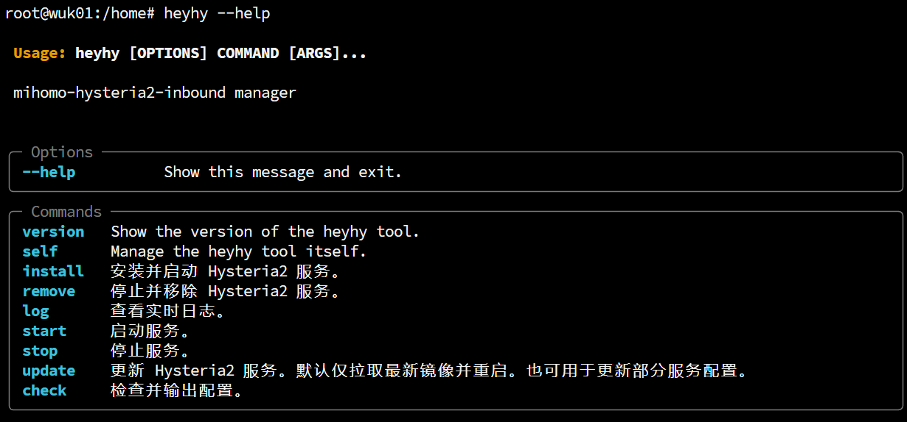

# Heyhy <a href = "https://t.me/+V1rQL8WFTNxiMjRh"></a>

Heyhy 用于快速部署 [hysteria2 server](https://github.com/apernet/hysteria) 并输出客户端最佳实践配置。只需 15s 即可完成全自动部署，开箱即用！

## What's features

| Supported Configuration         | Status |
| ------------------------------- | ------ |
| Hysteria2 server                | ✅      |
| NekoRay client proxy            | ✅      |
| sing-box `hy2` outbound         | ✅      |
| Clash.Meta `hysteria2` outbound | ✅      |
| Hysteria2 client                | ✅      |
| via Cloudflare CDN              | ✅      |

## Prerequisites

- 在管理员权限下运行
- 提前为你的服务器的 IPv4 解析一个域名 A 纪录

## Get started

一键部署脚本：

```bash
curl -LsSf https://astral.sh/uv/install.sh | sh && \
source $HOME/.local/bin/env && \
uv tool install heyhy && \
uv run heyhy install -d <填写域名>
```

> 首次安装完毕后，你可以通过别名指令 `heyhy` 调度脚本。

## Installation

安装指令详解：

```bash
heyhy install -d [DOMAIN]
```

| 必选参数         | 简介       |
| ---------------- | ---------- |
| `--domain`, `-d` | 绑定的域名 |

| 可选参数           | 简介                                                 |
| ------------------ | ---------------------------------------------------- |
| `--password`, `-p` | 手动指定连接密码 (可选，默认随机生成)                |
| `--ip`             | 手动指定服务器公网 IPv4 (可选，默认自动检测)         |
| `--port`           | 指定监听端口 (可选，默认 8443)                       |
| `--image`          | 指定托管镜像（可选，默认 `metacubex/mihomo:latest`） |

## What's next

移除所有项目依赖：

```bash
heyhy remove
```

升级脚本：

```bash
heyhy self update
```

根据正在运行的服务配置生成 `mihomo client outbound` 配置：

```bash
heyhy check
```

探索其他指令：

```bash
heyhy --help
```



## References

- [Hysteria2](https://v2.hysteria.network/zh/docs/getting-started/Client/)，hy2 官方文档

- [sing-box outbound - hysteria2](https://sing-box.sagernet.org/zh/configuration/outbound/hysteria2/) sing-box 客户端出站代理设置

- [mihomo outbound - hysteria2](https://wiki.metacubex.one/config/proxies/hysteria2/#hysteria2) mihomo/clash-meta 客户端出站代理设置

- [MatsuriDayo NekoRay configuration](https://matsuridayo.github.io/n-extra_core/#_5) nekoray / nekobox 客户端出战代理设置（该项目已停止维护）
